# Attention Terminal — Hackathon Demo Video Script & Narration Guide

> **Target Duration**: 3:00 - 3:30 (Max 5:00)  
> **Format**: Screen recording of working product + live narration (No slides / zero intro logos).  
> **Theme**: *Beyond the Wall of Text*  
> **Core Stack**: ClickHouse (Real-Time OLAP) + Trigger.dev v3 (Orchestration & Background Jobs)

---

## ⏱️ Video Timeline & Narration Breakdown

```mermaid
gantt
    title 3-Minute Demo Video Flow
    dateFormat  ss
    axisFormat %S
    section Screen Recording
    Live Product Demo & Morphing Canvas      :00, 60s
    Double-Click Repo Drill-Down             :60, 45s
    ClickHouse + Trigger.dev Engine          :105, 45s
    Architecture & Value Wrap-up             :150, 30s
```

---

### Segment 1: Live Product Demo & Morphing Canvas (0:00 – 1:00)
**Screen**: Open directly on Attention Terminal homepage. Type a query into the Persistent Floating Chatbox (Gemini Drawer): *"What are the top AI repositories accelerating this week?"*

**Voiceover Narration**:
> *"Welcome to Attention Terminal. Every traditional AI chat agent gives you the exact same thing: a wall of text—paragraphs, bullet points, maybe a raw table if you’re lucky. We built Attention Terminal to go **Beyond the Wall of Text**.*
>
> *When I ask Attention Terminal about repository momentum, the response itself is the product. Look at the Morphing Canvas. Instead of reading paragraphs, we immediately see Tufte-maximized SVG figures—a dynamic Treemap heatmap of ecosystem volume, a Stacked Bar chart comparing PR merge ratios, and a Donut distribution showing single-slice precision.*
>
> *Every visual element adheres to Edward Tufte’s data-ink ratio principles: zero chartjunk gridlines, direct labels, and tabular numerals (`tabular-nums`) to prevent visual jitter."*

---

### Segment 2: Double-Click Repo Drill-Down & Visual Discovery (1:00 – 1:45)
**Screen**: Click on a repository (e.g., `vllm-project/vllm`). Show the Morphing Card expand into the 4-tier Repo Drill-Down view. Scroll through the Push Preview Feed.

**Voiceover Narration**:
> *"When we double-click into a repository like `vllm`, Attention Terminal doesn't dump 200 lines of grep logs. It renders a 4-tier Drill-Down Card:*
> 1. *Hero KPIs showing 24-hour deltas (+42 Pushes, +120 Commits).*
> 2. *A 24-hour synchronized hourly velocity chart.*
> 3. *And a live Push Preview Feed mapping actor logins, target branch refs, commit density, and code churn.*
>
> *Users can introspect datasets in real-time through our persistent Gemini-style floating chatbox without losing their dashboard context."*

---

### Segment 3: The Dual Engine — ClickHouse + Trigger.dev (1:45 – 2:30)
**Screen**: Switch to ClickHouse Console / Terminal showing query execution times (<150ms) and Trigger.dev dashboard showing active background ingestion tasks.

**Voiceover Narration**:
> *"Under the hood, Attention Terminal is powered by a high-throughput **ClickHouse + Trigger.dev v3** dual engine:*
> - *Trigger.dev orchestrates high-frequency background ingestion workers, dbt continuous transformations, and async agent tasks.*
> - *ClickHouse serves as our real-time columnar analytical database, processing millions of GitHub Archive events.*
>
> *To achieve sub-second response times, we execute **single-pass conditional aggregation queries** over `created_at` buckets using `countIf` and `sum`. We structure data using a **Pseudo-Medallion Architecture**—Bronze append-only facts, Silver cleansed events with token bloom filter skipping indexes (`idx_github_events_actor_login`), and Gold `AggregatingMergeTree` rollups that reduce query scan sizes by >95%. All DDL changes are version-controlled via Goose migrations."*

---

### Segment 4: Architecture, Scalability & Closing (2:30 – 3:00)
**Screen**: Show `docs/architecture/SYSTEM-ARCHITECTURE.md` Mermaid diagram and GitHub repository main page.

**Voiceover Narration**:
> *"Attention Terminal includes a fail-open telemetry architecture—if database connections drop, model benchmarking logs fail-open via local NDJSON spooling for automatic backfill.*
>
> *Attention Terminal transforms raw developer event noise into actionable visual intelligence—proving that AI chat doesn't have to be text. Thank you."*

---

## 🎯 Production Checklist for Recording

- [ ] **Audio**: Use clear microphone with zero background noise.
- [ ] **Resolution**: 1080p or 4K screen capture.
- [ ] **Browser**: Dark mode enabled, clean browser tab (no extensions visible).
- [ ] **Pacing**: Speak briskly, clearly, and finish within 3:00 - 3:30.
- [ ] **No Slides**: Do NOT show PowerPoint slides or intro logos — open directly on the live product.