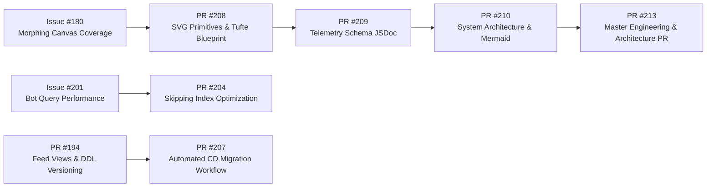

# Attention Terminal — Engineering Methodology & Architecture Index

> **Master Engineering Index, Architectural Decision Records (ADRs), Product Intentions & Beyond the Wall of Text Theme**

---

## 1. Hackathon Brief & Product Intentions

### 1.1 Theme: Beyond the Wall of Text
Traditional AI chat agents deliver a **wall of text**—paragraphs, bullet points, or raw log dumps. Attention Terminal replaces them with rendered visual components:
- **ClickHouse + Trigger.dev Dual Engine**: ClickHouse handles real-time OLAP queries while Trigger.dev orchestrates background jobs and continuous transformations (the 25% dual-tool judging criterion).
- **Floating Chatbox (Gemini Drawer)**: A persistent [`FloatingChat.tsx`](../src/components/FloatingChat.tsx) drawer lets users introspect datasets, ask natural-language questions, and discover insights without losing dashboard context.
- **Morphing Figures**: Custom SVG primitives (`PieChart`, `StackedBarChart`, `WaterfallChart`, `TreemapChart`, `DevScatterChart`, `HorizontalBarChart`) rendered dynamically via `RenderedAnswer.tsx`.

---

## 2. Architectural Decision Records (ADRs)

| ADR | Title | Key Architectural Choice | Status |
| :--- | :--- | :--- | :--- |
| **[ADR 0001](adr/0001-tufte-data-ink-svg-primitives.md)** | **Tufte Data-Ink Maximization & Hand-Rolled SVG Chart Primitives** | Replaced heavy third-party charting libraries with hand-rolled, zero-dependency React SVG primitives (`PieChart`, `StackedBarChart`, `WaterfallChart`, `TreemapChart`, `HorizontalBarChart`). | **Accepted** |
| **[ADR 0002](adr/0002-clickhouse-skipping-index-predicates.md)** | **ClickHouse Case-Insensitive Skipping Index Predicates** | Refactored `actor_login ILIKE '%[bot]%'` to `lower(actor_login) LIKE '%[bot]%'` to leverage ClickHouse `idx_github_events_actor_login` token bloom filter index. | **Accepted** |
| **[ADR 0003](adr/0003-subagent-telemetry-and-session-learnings.md)** | **Subagent Telemetry, Session Learnings & Fail-Open Spooling** | Standardized ClickHouse telemetry tracking (`subagent_runs`, `session_learnings`) with local NDJSON spooling fallbacks. | **Accepted** |
| **[ADR 0004](adr/0004-pseudo-medallion-clickhouse-data-modeling.md)** | **Pseudo-Medallion Architecture & Dataset Triangulation Trade-offs** | Implemented Bronze/Silver/Gold `_hourly`/`_daily`/`_monthly` `AggregatingMergeTree` rollups and Goose DDL migrations instead of Kimball star schemas. | **Accepted** |
| **[ADR 0005](adr/0005-double-click-repo-drilldown-card.md)** | **"Double-Click" Repo Drill-Down Card & Single-Pass Velocity Queries** | Standardized 4-tier drill-down card layout, single-pass hourly velocity SQL query strategy, and Push Preview Feed payload column mapping. | **Accepted** |

---

## 3. Core Documentation Index

- **[System Architecture & Mermaid Flowcharts](architecture/SYSTEM-ARCHITECTURE.md)**: 5-layer system overview (Inputs $\rightarrow$ Processing $\rightarrow$ Data $\rightarrow$ Backend $\rightarrow$ Frontend).
- **[Storytelling with Data & UI Philosophies](architecture/STORYTELLING-WITH-DATA-AND-UI-PHILOSOPHIES.md)**: Edward Tufte principles, Geist monospaced precision, and visual preattentive attributes.
- **[Product Owner Vision & Problem Statement](product/PRODUCT-VISION-AND-METHODOLOGY.md)**: Hackathon brief, Beyond the Wall of Text philosophy, and component breakdown.
- **[Rendered SVG Primitives Evidence](pr-evidence/208/primitives-rendered-evidence.html)**: Static HTML snapshot evidence for PR #208.

---

## 4. GitHub PR & Issue Lineage



### Detailed PR Reference Matrix

- **[PR #208](https://github.com/victoremnm/attention-terminal/pull/208)** (*Merged*): Implemented `PieChart`, `StackedBarChart`, `WaterfallChart`, and `TreemapChart` SVG primitives in `src/components/charts.tsx` with stress tests and snapshot regression suite.
- **[PR #204](https://github.com/victoremnm/attention-terminal/pull/204)** (*Merged*): Optimized ClickHouse bot filtering predicates to match `idx_github_events_actor_login` skip index.
- **[PR #194](https://github.com/victoremnm/attention-terminal/pull/194)** (*Merged*): Fixed Goose DDL migration versioning and `gh_repo_activity_feed` commit count queries.
- **[PR #207](https://github.com/victoremnm/attention-terminal/pull/207)** (*Merged*): Automated CD migration execution on merge to `main` via `.github/workflows/cd.yml`.
- **[PR #209](https://github.com/victoremnm/attention-terminal/pull/209)** (*Open*): Subagent telemetry JSDoc schema documentation.
- **[PR #210](https://github.com/victoremnm/attention-terminal/pull/210)** (*Open*): System Architecture blueprint with Mermaid diagrams.
- **[PR #213](https://github.com/victoremnm/attention-terminal/pull/213)** (*Open*): Master Engineering, Architecture & Methodology PR.

---

## 5. Rendered Code Snippet Highlights

### 5.1 Pie Chart "Other" Slice Capping & Single Ring Fallback
```tsx
// src/components/charts.tsx
const displayItems = items.length > 7
  ? [
      ...items.slice(0, 6),
      { label: "Other", value: items.slice(6).reduce((sum, item) => sum + item.value, 0), color: "var(--muted)" },
    ]
  : items;

{slices.length === 1 ? (
  <circle cx={cx} cy={cy} r={(r + innerR) / 2} fill="none" stroke={slices[0].color} strokeWidth={r - innerR} opacity="0.88" />
) : (
  slices.map((slice, idx) => (
    <path key={`${slice.label}-${idx}`} d={slice.d} fill={slice.color} opacity="0.88" stroke="var(--s)" strokeWidth="1.5" />
  ))
)}
```

### 5.2 Stacked Bar Global Key Color Indexing
```tsx
// src/components/charts.tsx
const segmentKeys = Array.from(new Set(items.flatMap((i) => i.segments.map((s) => s.key))));

{item.segments.map((seg, sIdx) => {
  const keyIdx = segmentKeys.indexOf(seg.key);
  const segColor = seg.color || colors[(keyIdx >= 0 ? keyIdx : sIdx) % colors.length];
  return <rect key={`${seg.key}-${sIdx}`} x={segX} y={y} width={Math.max(0, segW)} height={barH} fill={segColor} opacity="0.88" />;
})}
```

