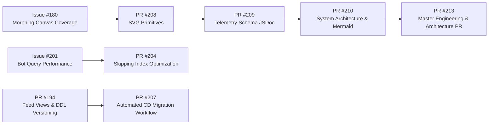

# Attention Terminal — Engineering Methodology & Architecture Index

> Reference index for the project’s design choices, supporting docs, and related ADRs.

---

## 1. Project overview

Attention Terminal presents developer activity as charts and cards instead of long text dumps.

The current design centers on three ideas:

- ClickHouse provides the analytics layer for live queries and rollups.
- Trigger.dev handles ingestion, refresh jobs, and other background work.
- The UI renders answers as charts and drill-down cards so users can inspect data quickly.

---

## 2. Architectural Decision Records

| ADR | Title | Summary | Status |
| :--- | :--- | :--- | :--- |
| **[ADR 0001](adr/0001-tufte-data-ink-svg-primitives.md)** | **Custom SVG Chart Primitives** | Uses custom React SVG primitives instead of a charting library. | **Accepted** |
| **[ADR 0002](adr/0002-clickhouse-skipping-index-predicates.md)** | **ClickHouse Case-Insensitive Skipping Index Predicates** | Rewrites bot filters to use ClickHouse-friendly predicates. | **Accepted** |
| **[ADR 0003](adr/0003-subagent-telemetry-and-session-learnings.md)** | **Subagent Telemetry, Session Learnings & Fail-Open Spooling** | Stores subagent runs in ClickHouse with local spooling fallback. | **Accepted** |
| **[ADR 0004](adr/0004-pseudo-medallion-clickhouse-data-modeling.md)** | **Rollup-Based Data Modeling** | Organizes data into hourly, daily, and monthly rollups with Goose migrations. | **Accepted** |
| **[ADR 0005](adr/0005-double-click-repo-drilldown-card.md)** | **"Double-Click" Repo Drill-Down Card & Single-Pass Velocity Queries** | Defines the repo drill-down layout and query strategy. | **Accepted** |
| **[ADR 0006](adr/0006-database-family-query-isolation.md)** | **`raw` Database Family for Firehose Query Isolation** | Adds thin `raw.*` views for the firehose tables while keeping storage in `default`. | **Accepted** |
| **[ADR 0007](adr/0007-storytelling-with-data-and-council-of-agents.md)** | **Chart Selection & Model Benchmarking** | Describes chart-selection rules and model comparisons. | **Accepted** |

---

## 3. Core documentation

- **[Demo Script & Narration Guide](DEMO-SCRIPT.md)** — concise recording script for the hackathon video.
- **[Hackathon Submission Portal Fields](SUBMISSION-FORM.md)** — submission-ready title, tagline, summary, and scoring alignment.
- **[System Architecture & Mermaid Flowcharts](architecture/SYSTEM-ARCHITECTURE.md)** — end-to-end system diagram.
- **[Storytelling with Data & UI Philosophies](architecture/STORYTELLING-WITH-DATA-AND-UI-PHILOSOPHIES.md)** — charting and visual design rules.
- **[Product Owner Vision & Problem Statement](product/PRODUCT-VISION-AND-METHODOLOGY.md)** — user-facing product intent and layout.
- **[Rendered SVG Primitives Evidence](pr-evidence/208/primitives-rendered-evidence.html)** — evidence for the core rendered primitives.

---

## 4. PR and issue lineage



### Related PRs

- **PR #208** — added the first set of custom SVG chart primitives.
- **PR #204** — optimized bot filtering to match the ClickHouse skip index.
- **PR #194** — fixed Goose migration versioning and commit count handling.
- **PR #207** — wired CD to apply migrations on merge to `main`.
- **PR #209** — documented the telemetry schema.
- **PR #210** — added the system architecture diagrams.
- **PR #213** — consolidated the engineering and architecture docs.

---

## 5. Implementation notes

### 5.1 Pie chart fallback
```tsx
const displayItems = items.length > 7
  ? [
      ...items.slice(0, 6),
      { label: "Other", value: items.slice(6).reduce((sum, item) => sum + item.value, 0), color: "var(--muted)" },
    ]
  : items;
```

### 5.2 Stacked bar color indexing
```tsx
const segmentKeys = Array.from(new Set(items.flatMap((i) => i.segments.map((s) => s.key))));

{item.segments.map((seg, sIdx) => {
  const keyIdx = segmentKeys.indexOf(seg.key);
  const segColor = seg.color || colors[(keyIdx >= 0 ? keyIdx : sIdx) % colors.length];
  return <rect key={`${seg.key}-${sIdx}`} x={segX} y={y} width={Math.max(0, segW)} height={barH} fill={segColor} opacity="0.88" />;
})}
```
