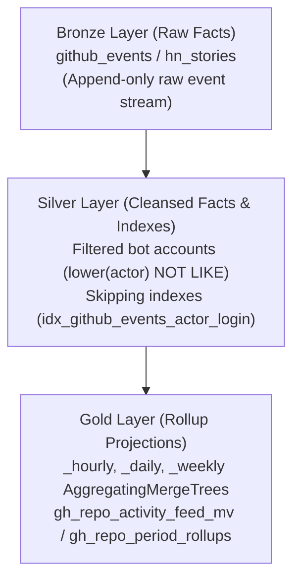

# ADR 0004: Pseudo-Medallion Architecture & Dataset Triangulation Trade-offs

- **Status**: Accepted
- **Date**: 2026-07-23
- **Context**: ClickHouse OLAP Data Modeling & Ingestion Strategy

## Context & Problem Statement
During initial design, we evaluated two primary data integration strategies:
1. **Hacker News + GitHub Triangulation**: Attempting to cross-reference Hacker News stories/comments with GitHub repository events to correlate social buzz with code commits.
2. **Data Warehouse Modeling Strategy**: Choosing between traditional Kimball dimensional modeling (star schema with facts and dimensions) vs. a real-time columnar **Pseudo-Medallion Architecture** in ClickHouse.

## Decision Drivers & Findings

### 1. Dataset Shape & Triangulation Rationale
- **Hacker News Limitations**: Hacker News payloads consist of unstructured text titles and comment threads with minimal dimensional structure (`id`, `by`, `score`, `title`, `url`). Triangulating HN stories to GitHub repos required fragile string matching on URLs/names and yielded noisy, sparse signals.
- **GitHub Event Stream Richness**: The GitHub Archive event stream provides rich, strongly-typed facts across multiple native dimensions (`repo`, `actor`, `org`, `created_at`) and granular event shapes (`PushEvent`, `PullRequestEvent`, `IssuesEvent`, `WatchEvent`, `ForkEvent`).
- **HuggingFace Exploration (Deferred)**: Evaluated integrating HuggingFace models, datasets, and spaces metadata to correlate ML model trends with GitHub repositories. Ran out of discovery time; model weight releases felt somewhat orthogonal to source code commit velocity, though relevant for AI repository tracking.
- **Google Places API (Deferred)**: Evaluated Google Places / Maps API to render geographical contributor maps or physical event heatmaps. Deferred because physical location lacked a strong fit for core telemetry metrics (which prioritize repository speed, star breakouts, and commit deltas).

### 2. Pseudo-Medallion Architecture vs. Kimball Modeling
Instead of complex Kimball star schemas (which require expensive SQL joins across `dim_actor`, `dim_repo`, `fact_events`), we implemented a high-performance **Pseudo-Medallion Architecture** optimized for ClickHouse columnar execution:

- **Bronze Layer (Raw Ingestion)**: Append-only `github_events` table capturing raw JSON event payloads at high throughput.
- **Silver Layer (Cleansed Facts & Skipping Indexes)**: Deduplicated event facts with `lower(actor_login)` skip index filtering to remove bot traffic (`[bot]`, `copilot`, `dependabot`).
- **Gold Layer (AggregatingMergeTree Rollups)**: Continuous rollups pre-computed into `_hourly`, `_daily`, and `_weekly` `AggregatingMergeTree` tables via Materialized Views (`gh_repo_activity_feed_mv`, `gh_repo_period_rollups`), reducing query scan sizes by >95%.

### 3. Goose Schema Migration System
To manage DDL changes safely across environments without ad-hoc DDL queries, all schema changes are managed via **Goose DDL migrations** (`migrations/*.sql` + `./scripts/migrate.sh`) integrated into automated CD workflows on merge to `main`.

## Decision Outcome
Accepted. The Pseudo-Medallion pattern combined with Goose DDL migrations delivers sub-second query performance across tens of millions of GitHub events while avoiding join penalties.
