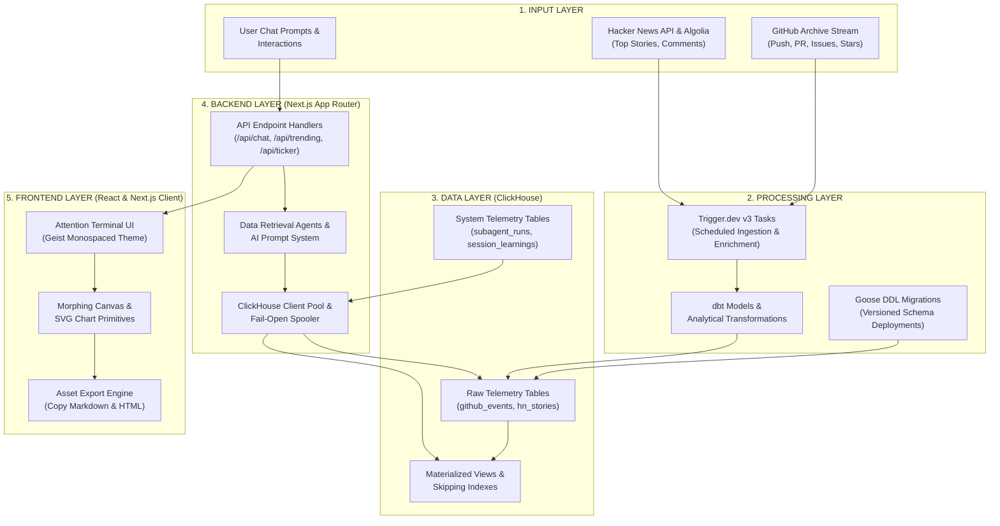
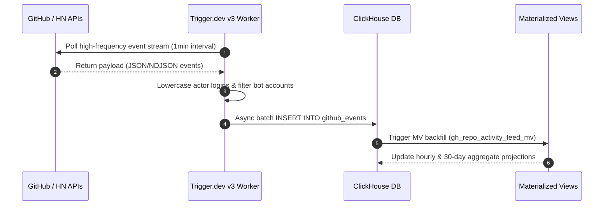
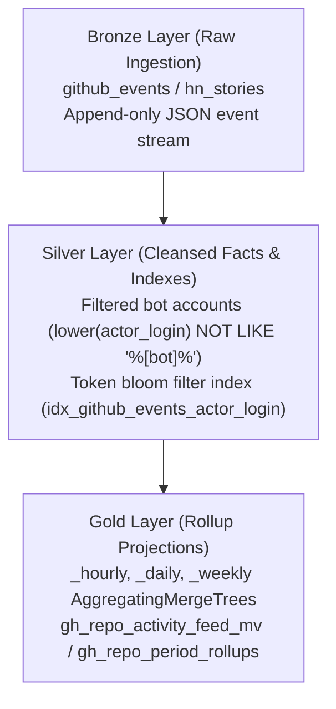
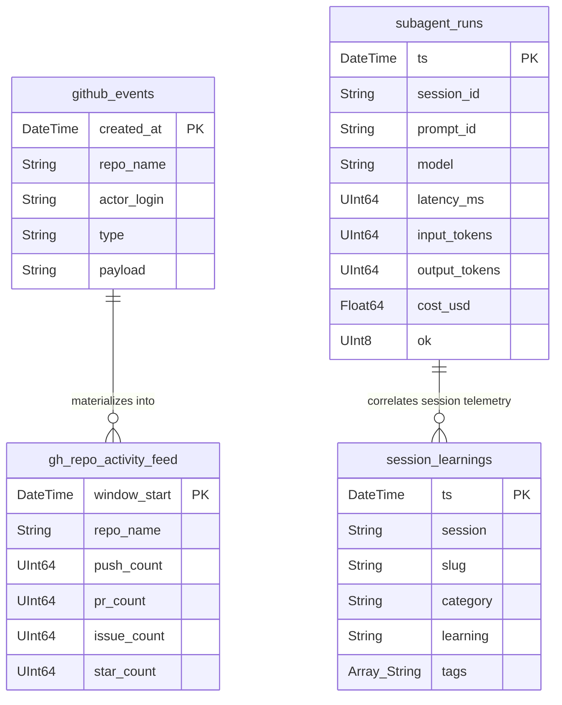
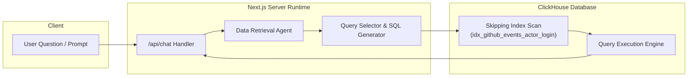
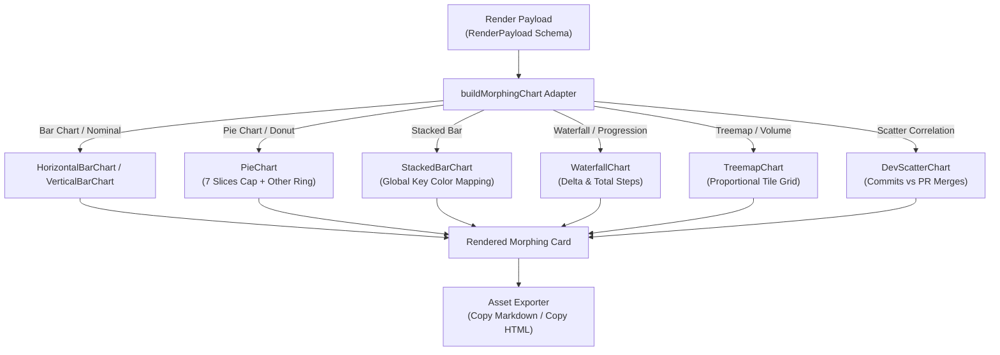

# Attention Terminal — End-to-End System Architecture

> **Architectural Blueprint & Flow Diagrams (Inputs $\rightarrow$ Processing $\rightarrow$ Data $\rightarrow$ Backend $\rightarrow$ Frontend)**

---

## 1. High-Level Architecture Overview

Attention Terminal is a real-time, LLM-powered telemetry and analytics dashboard for open-source developer activity. It ingests massive raw event streams from GitHub and Hacker News into ClickHouse, processes high-frequency metrics through background tasks and materialized views, and serves narrative-driven SVG visualizations through a Next.js App Router interface.

---

## 2. Ingestion & Processing Pipeline (Inputs $\rightarrow$ Processing $\rightarrow$ Data)

The processing layer transforms raw external events into structured ClickHouse analytical tables. Background jobs run on Trigger.dev v3, executing streaming inserts and continuous aggregations.

### Pseudo-Medallion Data Architecture (Bronze $\rightarrow$ Silver $\rightarrow$ Gold)

Instead of a traditional Kimball star schema (which introduces expensive joins in real-time OLAP queries), Attention Terminal structures data using a **Pseudo-Medallion Architecture**:

1. **Bronze (Raw Append-Only)**: Ingests GitHub Archive and Hacker News raw event payloads at high throughput into `github_events` and `hn_stories`.
2. **Silver (Cleansed & Indexed Facts)**: Cleansed event facts utilizing `idx_github_events_actor_login` token bloom filter skipping indexes to filter bot traffic (`[bot]`, `copilot`, `dependabot`) without full-table scans.
3. **Gold (AggregatingMergeTree Rollups)**: Continuous rollups pre-computed into `_hourly`, `_daily`, and `_weekly` `AggregatingMergeTree` tables and Materialized Views (`gh_repo_activity_feed_mv`, `gh_repo_period_rollups`), reducing query scan sizes by >95%.
4. **Goose Schema Migrations**: All ClickHouse DDL transformations are version-controlled via **Goose DDL migrations** (`migrations/*.sql` + `./scripts/migrate.sh`) and automatically deployed via CD on merge to `main`.

### Data Layer Schema Map

---

## 3. Backend Agent Routing & Query Architecture

When a user submits a query to `/api/chat` or requests a repo drilldown, the backend orchestrates data retrieval through specialized AI prompt agents and executes optimized ClickHouse queries.

---

## 4. Frontend Component & Morphing Canvas Architecture

The frontend renders analytical answers via the **Morphing Canvas**. Based on the `visualizationType` returned in the render payload, the adapter routes data to dedicated Tufte-aligned SVG chart primitives.

---

## 5. System Design Principles Summary

| Layer | Primary Responsibilities | Core Architectural Choice |
| :--- | :--- | :--- |
| **1. Inputs** | Event collection from GitHub Archive, HN, user chat | Asynchronous background polling via Trigger.dev |
| **2. Processing** | Stream parsing, bot filtering, schema migrations | Goose DDL migrations & dbt models |
| **3. Data** | Fast OLAP analytics, telemetry tracking, session memory | ClickHouse with skipping indexes & `FINAL` deduplication |
| **4. Backend** | API routing, AI agent orchestration, ClickHouse pool | Next.js App Router + streaming JSON responses |
| **5. Frontend** | Visualization, responsive layout, markdown/HTML export | Tufte data-ink maximized hand-rolled SVG primitives |
