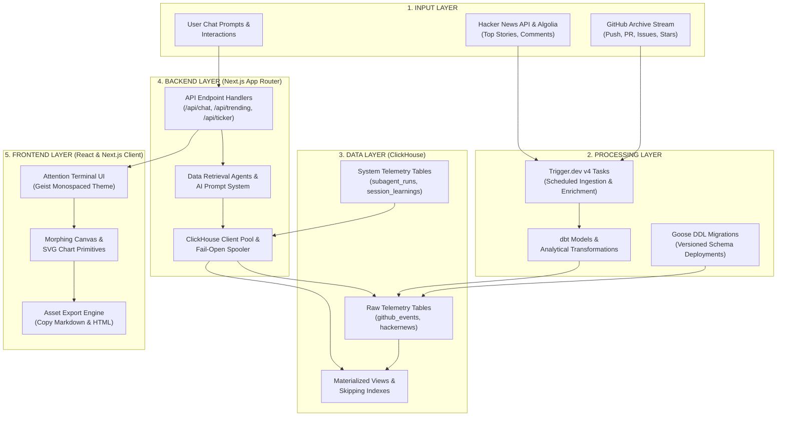
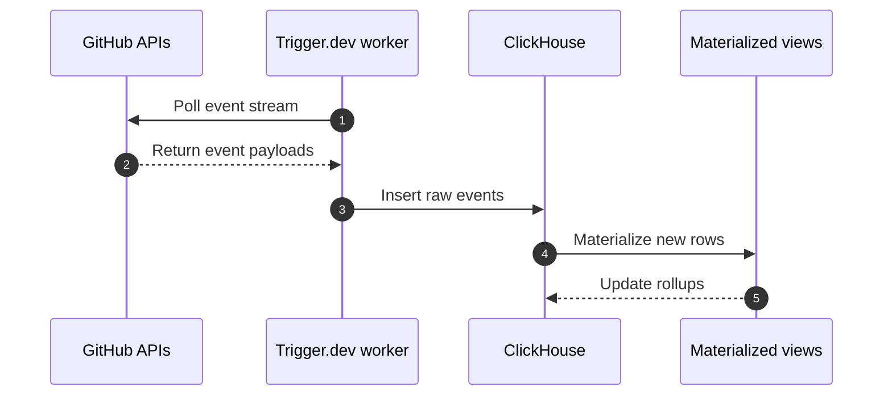
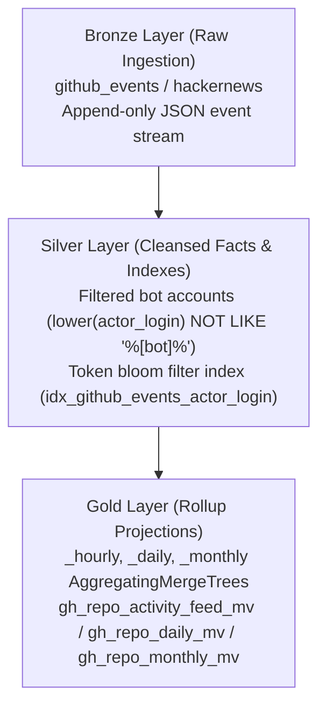
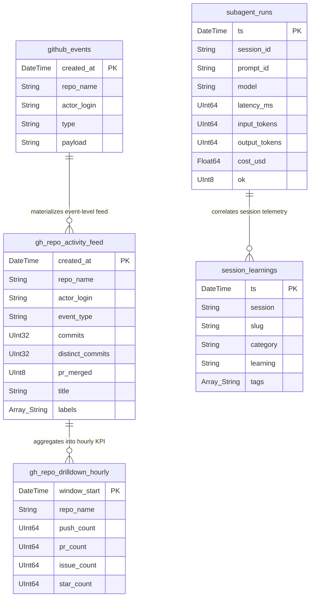
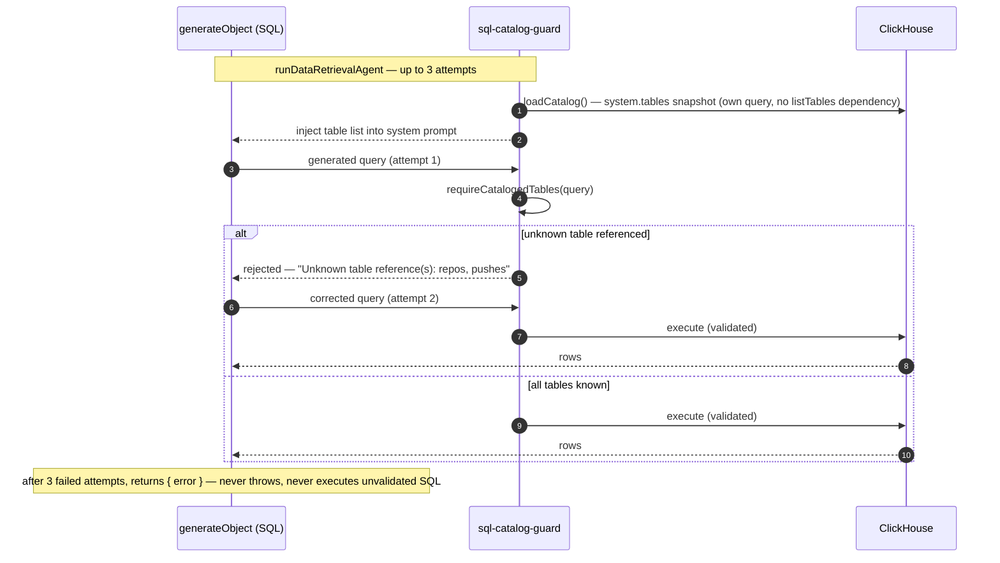
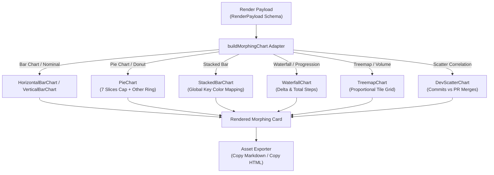

# Attention Terminal — End-to-End System Architecture

> **Architectural Blueprint & Flow Diagrams (Inputs $\rightarrow$ Processing $\rightarrow$ Data $\rightarrow$ Backend $\rightarrow$ Frontend)**

---

## 1. High-Level Architecture Overview

Attention Terminal is a real-time, LLM-powered telemetry and analytics dashboard for open-source developer activity. It ingests high-volume raw event streams from GitHub and Hacker News into ClickHouse, processes high-frequency metrics through background tasks and materialized views, and serves narrative-driven SVG visualizations through a Next.js App Router interface.



---

## 2. Ingestion & Processing Pipeline (Inputs $\rightarrow$ Processing $\rightarrow$ Data)

The processing layer transforms raw external events into structured ClickHouse analytical tables. Background jobs run on Trigger.dev v4, executing streaming inserts and continuous aggregations.



Bot filtering happens when queries run, and any historical backfill still uses an explicit `INSERT INTO ... SELECT`.

### Pseudo-Medallion Data Architecture (Bronze $\rightarrow$ Silver $\rightarrow$ Gold)

Instead of a traditional Kimball star schema (which introduces expensive joins in real-time OLAP queries), Attention Terminal organizes data in a **Pseudo-Medallion Architecture**:



1. **Bronze (Raw Append-Only)**: Ingests GitHub Archive and Hacker News raw event payloads at high throughput into `default.github_events` and `default.hackernews`. Per ADR-0006, all read-path SQL queries these through the `raw` database (`raw.github_events`, `raw.hackernews`) — thin passthrough Views created for query isolation without moving the physical tables. Ingestion tasks must still write to `default.*` directly, since ClickHouse Views cannot be `INSERT` targets.
2. **Silver (Cleansed & Indexed Facts)**: Cleansed event facts filter bot traffic (`[bot]`, `copilot`, `dependabot`) via `lower(actor_login) NOT LIKE '%[bot]%'`. The `idx_github_events_actor_login` token bloom-filter skipping index is defined on this column for equality/`LIKE` lookups, but per `docs/architecture/EXPLAIN-QUERY-AUDIT.md`'s production `EXPLAIN indexes = 1` audit it does not currently prune granules for this predicate (bot activity is too evenly distributed across the table's time-ordered granules) — see issue #201.
3. **Gold (AggregatingMergeTree Rollups)**: Continuous rollups are pre-computed into `_hourly`, `_daily`, and `_monthly` `AggregatingMergeTree` tables and materialized views (`gh_repo_activity_feed_mv`, `gh_repo_daily_mv`, `gh_repo_monthly_mv`), reducing query scan sizes by orders of magnitude versus scanning `github_events` directly. Historical rows for newly declared MVs require an explicit `INSERT INTO ... SELECT` backfill, per AGENTS.md conventions.
4. **Goose Schema Migrations**: All ClickHouse DDL is version-controlled through **Goose migrations** (`migrations/*.sql` + `./scripts/migrate.sh`) and deployed automatically via CD on merge to `main`.

### Data Layer Schema Map



---

## 3. Chat Agent — Trigger Flow & Query Paths

Chat is not a Next.js API route — there is no `/api/chat` handler in this repo. The entire agent lives inside Trigger.dev's realtime chat runtime as `chat.agent()`, defined in `src/trigger/attention-agent.ts`.

### 3.1 Chat agent lifecycle

```mermaid
sequenceDiagram
    autonumber
    participant Client as Chat Client
    participant Agent as attentionAgent (chat.agent)
    participant Catalog as catalogPromptSection() / sql-catalog-guard
    participant Model as streamText (attentionTools)

    Client->>Agent: onBoot (worker cold start)
    Agent->>Catalog: resetCatalogState()
    Note over Agent: init per-worker conversation memory (recentAnswers)

    Client->>Agent: onChatStart (turn 0)
    Agent->>Catalog: catalogPromptSection() — live system.tables snapshot
    Agent->>Agent: resolve system prompt (catalog + answer reference)

    Client->>Agent: onTurnStart (turn >= 1)
    Agent->>Catalog: re-fetch catalog, re-resolve prompt w/ prior-turn memory

    Client->>Model: run({ messages, tools })
    Model->>Model: stopWhen 15 steps; prepareStep forces renderAnswer near budget
    Model-->>Client: streamed tool calls + final answer

    Client->>Agent: onTurnComplete
    Agent->>Agent: record rendered answer type/subject for next turn's memory
```

### 3.2 Tool registry and query-execution paths

`attentionTools` (`src/lib/agent-tools.ts`) is the full tool surface exposed to the model. Each tool falls into one of three categories:

| Category | Tools | SQL origin | Guarded? |
| :--- | :--- | :--- | :--- |
| Catalog introspection | `listTables`, `describeTable` | Fixed (`system.tables`, `DESCRIBE TABLE`) | Populates the shared catalog cache |
| **LLM-generated SQL** | `runReadOnlyQuery`, `runDataRetrieval` → `runDataRetrievalAgent` | Written by an LLM from the user's intent | **Yes — see 3.3** |
| Hardcoded queries | `getDailyDigest`, `getRealBuilders`, `getRepoDrilldown` | Fixed, developer-authored SQL (`digest.ts`, `real-builders.ts`, `queries.ts`) | Not applicable — no LLM in the SQL path |
| Payload shaping / no SQL | `renderAnswer`, `buildMorphingCard`, `buildTablePayload`, `runVisualizationMapping` | None — shapes rows already fetched by one of the above | Not applicable |

There are **two independent LLM-generated-SQL paths**, and both must be guarded — this is the lesson from the July 23 hallucination incident (a query against fabricated `repos`/`pushes`/`commits`/`pull_requests`/`issues` tables, and a `hn_hourly.time` column that doesn't exist, both reached ClickHouse directly):

1. **`runReadOnlyQuery`** — the primary "custom SQL" path documented in the system prompt (`agent-prompt.ts`): the model must call `listTables`, then `describeTable` on every referenced table, before this tool will run anything. If it skips ahead, the tool returns an actionable `{ error }` telling it to call `listTables`/`describeTable` first — it never reaches ClickHouse with an unvalidated query.
2. **`runDataRetrieval` → `runDataRetrievalAgent`** (`src/lib/agents/data-retrieval-agent.ts`) — a second, sanctioned shortcut for ad-hoc questions, with its own independent `generateObject` call. This path had **no catalog grounding and no validation** until this fix — it generated SQL from a schema-less prompt and executed it directly. It cannot call `listTables`/`describeTable` itself (no tool-calling loop, just one structured-output call), so it now self-grounds instead.

### 3.3 The catalog guard (`src/lib/sql-catalog-guard.ts`)

Both paths validate against the **same** shared module — extracted specifically so the two paths can't drift apart again the way they did before this fix:

- `extractTableCandidates(query)` — regexes out every `FROM`/`JOIN` table reference, excluding CTE names.
- `requireCatalogedTables(query)` — returns any referenced table not present in the live `system.tables` snapshot.
- `requireDescribedTables(query)` — (used by `runReadOnlyQuery` only) returns any referenced table whose columns haven't been fetched via `describeTable` yet.



Neither path throws on failure — both return a structured `{ error }` result, matching the codebase-wide convention (see `runReadOnlyQuery`'s catch block) so a rejected query becomes a normal tool result the top-level agent can react to (retry with a different tool, ask a clarifying question) rather than a crash.

---

## 4. Frontend Component & Morphing Canvas Architecture

The frontend renders analytical answers via the **Morphing Canvas**. Based on the `visualizationType` returned in the render payload, the adapter routes data to dedicated Tufte-aligned SVG chart primitives.



---

## 5. System Design Principles Summary

| Layer | Primary Responsibilities | Core Architectural Choice |
| :--- | :--- | :--- |
| **1. Inputs** | Event collection from GitHub Archive, HN, user chat | Asynchronous background polling via Trigger.dev |
| **2. Processing** | Stream parsing, bot filtering, schema migrations | Goose DDL migrations & dbt models |
| **3. Data** | Fast OLAP analytics, telemetry tracking, session memory | ClickHouse with skipping indexes & `FINAL` deduplication |
| **4. Backend** | API routing, AI agent orchestration, ClickHouse pool | Next.js App Router + streaming JSON responses |
| **5. Frontend** | Visualization, responsive layout, markdown/HTML export | Hand-rolled SVG primitives that maximize Tufte data-ink ratio |
