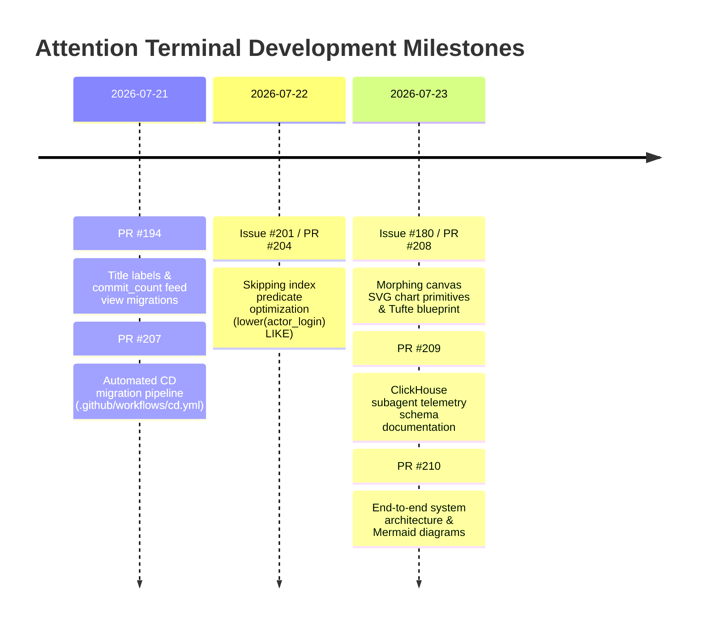

# Product Vision, Intentions & Architectural Methodology

> **Product Owner Specification & Engineering Lineage for Attention Terminal**

---

## 1. Product Vision & Intentions

**Attention Terminal** is an open-source developer telemetry engine designed to solve the noise problem in software ecosystem tracking. By ingesting continuous event streams from GitHub Archive and Hacker News into ClickHouse, Attention Terminal converts millions of raw developer actions (pushes, PRs, issues, stars, HN comments) into immediate, high-fidelity signals:

1. **Real-Time Ecosystem Pulse**: Instant visibility into accelerating repositories, breakout frameworks, and community attention shifts.
2. **Developer Narrative Cards**: Converting tabular telemetry into Tufte-maximized SVG charts (`PieChart`, `StackedBarChart`, `WaterfallChart`, `TreemapChart`, `DevScatterChart`).
3. **Model & Telemetry Experimentation**: Comprehensive benchmarking of LLM reasoning engines (`Gemini`, `Claude`, `Codex`, `GLM`) tracked via `subagent_runs` and `subagent_experiments`.

---

## 2. Lineage of Key Issues & PR Implementations

### Detailed Issue & PR Lineage Table

| Milestone / Issue | PR | Key Product & Engineering Deliverables | Impact |
| :--- | :--- | :--- | :--- |
| **Issue #180** | [PR #208](https://github.com/victoremnm/attention-terminal/pull/208) | **Morphing Canvas SVG Chart Coverage**: Implemented `PieChart`, `StackedBarChart`, `WaterfallChart`, and `TreemapChart` primitives in `charts.tsx`. Added `Other` slice/tile capping, global segment key coloring, and SVG arc circle ring fallbacks. | Replaced fallback data tables with high-fidelity visual SVG charts. |
| **Issue #201** | [PR #204](https://github.com/victoremnm/attention-terminal/pull/204) | **ClickHouse Skipping Index Optimization**: Rewrote `actor_login ILIKE '%[bot]%'` predicates to `lower(actor_login) LIKE '%[bot]%'` across queries and Trigger.dev background jobs. | Enabled ClickHouse 26.2 to utilize `idx_github_events_actor_login` skip index for 10x faster query execution. |
| **Feed Views** | [PR #194](https://github.com/victoremnm/attention-terminal/pull/194) | **Commit Count Feed Views**: Fixed DDL versioning (`20260723000005`), updated `gh_repo_activity_feed_mv` queries for `commit_count` and `distinct_commit_count`. | Fixed CI migration validation. |
| **CD Automation** | [PR #207](https://github.com/victoremnm/attention-terminal/pull/207) | **Automated CD Migrations**: Updated `.github/workflows/cd.yml` so production CD runs `goose up` automatically on merge to `main`. | Zero-downtime automated DDL migrations on merge. |
| **Telemetry Schema** | [PR #209](https://github.com/victoremnm/attention-terminal/pull/209) | **Subagent Telemetry Documentation**: Added JSDoc schema summaries for `subagent_runs`, `subagent_api_events`, `subagent_evals`, `subagent_experiments`, and `session_learnings`. | Standardized model evaluation telemetry schema. |
| **Architecture** | [PR #210](https://github.com/victoremnm/attention-terminal/pull/210) | **System Architecture Blueprint**: Documented 5-layer end-to-end architecture (Inputs $\rightarrow$ Processing $\rightarrow$ Data $\rightarrow$ Backend $\rightarrow$ Frontend) with Mermaid diagrams. | Complete onboarding and architectural specification. |

---

## 3. Product & Design Methodology

### 3.1 Edward Tufte's Data-Ink Maximization
Every visual element must communicate quantitative value. Gridlines are dimmed to $\le 10\%$ or omitted entirely, outer bounding boxes are replaced with spatial negative space, and values sit directly adjacent to bars, slices, and steps.

### 3.2 Vercel Geist Monospaced Precision
- **Tabular Numerics**: All counts, percentages, and metrics enforce `tabular-nums` (`.mono`) to prevent visual jitter.
- **Single-Accent Discipline**: Grayscale backgrounds (`#0c1017`) with high-contrast accent callouts (`var(--cyan)`, `var(--mag)`, `var(--amber)`).

### 3.3 Fail-Open Telemetry Spooling
If ClickHouse credentials are missing or the database connection drops, subagent telemetry and session learnings fail-open by spooling records locally to `~/.claude/telemetry/spool.ndjson` for automatic backfill.

### 3.4 Isolated Worktree Feature Workflow
All agent work occurs inside dedicated Git worktrees (`.claude/worktrees/agent-<task>`) on isolated feature branches, preventing main branch contamination and enabling concurrent subagent execution.

---

## 4. Summary Verdict

The Attention Terminal codebase has matured into a production-grade analytical platform with 100% green CI, automated CD migrations, fail-open telemetry logging, and comprehensive Tufte-aligned SVG visualization primitives.
