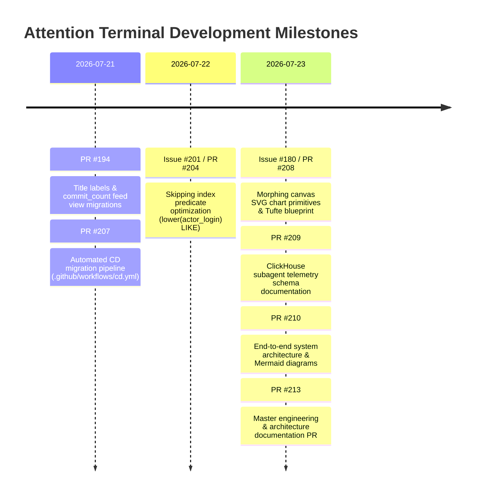

# Product Vision, Intentions & Architectural Methodology

> **Product Owner Specification, Problem Statement & Engineering Lineage for Attention Terminal**

---

## 1. Problem Statement & The "Beyond the Wall of Text" Philosophy

### 1.1 Hackathon Brief & Theme
Traditional AI chat interfaces fail users by delivering a **"wall of text"**—dense paragraphs, repetitive bullet points, or raw unreadable log/table dumps. Attention Terminal fundamentally rejects this paradigm.

> **Theme**: *Beyond the Wall of Text*  
> **Core Mandate**: The response *itself* must be the product: visual, interactive, and explorable. If an agent’s best answer is a paragraph, it has missed the brief.

### 1.2 Dual Engine: Trigger.dev + ClickHouse (25% Evaluation Score)
Attention Terminal leverages a high-throughput dual-engine architecture:
- **ClickHouse**: Serves as the ultra-fast real-time data layer executing sub-second analytical queries across millions of developer events (`github_events`, `hn_stories`) using specialized skipping indexes (`idx_github_events_actor_login`).
- **Trigger.dev v3**: Orchestrates background ingestion workers, dbt continuous transformations, and async agent execution loops.

### 1.3 Unpursued Exploration & Dataset Comparison
During initial discovery, we evaluated additional external APIs and datasets to triangulate developer activity:
- **Hacker News**: Attempted to cross-reference HN stories and comments with developer activity. Met limited success due to unstructured text titles and sparse dimensional attributes, yielding noisy signals.
- **GitHub Archive Stream**: Exceptionally rich with explicit facts, timestamps, and multi-dimensional entities (`repo_name`, `actor_login`, `org`, event types). The deep structure of GitHub events provided superior introspection capabilities.
- **HuggingFace Models & Spaces**: Explored correlating HuggingFace model weight releases and dataset activity with AI GitHub repos. Ran out of discovery time; model weight drops felt somewhat orthogonal to source code commit velocity, though valuable for future expansion.
- **Google Places / Maps API**: Evaluated rendering geographical contributor maps or physical hackathon event heatmaps. Deferred because physical location lacked a strong fit for core telemetry metrics (which prioritize repository speed, star breakouts, and commit deltas).

### 1.4 Data Warehousing Rationale: Pseudo-Medallion vs. Kimball Modeling
Rather than implementing a traditional **Kimball star schema** (which imposes join penalties across dimensional lookup tables in real-time analytical queries), we designed a **Pseudo-Medallion Architecture**:
- **Bronze Layer**: Append-only raw facts in `github_events`.
- **Silver Layer**: Cleansed events with bot-filtering (`lower(actor_login) NOT LIKE '%[bot]%'`) and token bloom filter skipping indexes (`idx_github_events_actor_login`).
- **Gold Layer**: Pre-aggregated rollups via `_hourly`, `_daily`, and `_weekly` `AggregatingMergeTree` tables and Materialized Views (`gh_repo_activity_feed_mv`, `gh_repo_period_rollups`), reducing scan sizes by >95%.
- **Migration System**: Version-controlled DDL evolution using **Goose DDL migrations** (`migrations/*.sql` + `./scripts/migrate.sh`) integrated into production CD pipelines.

---

## 2. Key Interactive Components Built for Discovery

To empower users to introspect data and ask straightforward discovery questions, Attention Terminal implements two primary frontend component innovations:

```mermaid
flowchart TD
    subgraph Discovery UI Components
        DRAWER["Persistent Floating Chatbox\n(Gemini Drawer / FloatingChat.tsx)"]
        MORPH["Morphing Canvas Figures\n(RenderedAnswer.tsx Adapter)"]
    end

    subgraph Visual SVG Primitives (charts.tsx)
        PIE["PieChart\n(Donut & Other Capping)"]
        STACK["StackedBarChart\n(Global Key Color Mapping)"]
        WATER["WaterfallChart\n(Delta & Total Progression)"]
        TREE["TreemapChart\n(2D Spatial Heatmaps)"]
        SCATTER["DevScatterChart\n(Commits vs Merged PRs)"]
        BAR["HorizontalBarChart\n(Nominal Rankings)"]
    end

    DRAWER -->|Triggers Prompts & Exploration| MORPH
    MORPH --> PIE
    MORPH --> STACK
    MORPH --> WATER
    MORPH --> TREE
    MORPH --> SCATTER
    MORPH --> BAR
```

### 2.1 Persistent Floating Chatbox (Gemini-Style Drawer)
- **Component**: [`src/components/FloatingChat.tsx`](file:///Users/victorem/Code/Repositories/victoremnm/clickhouse-trigger-hackathon/src/components/FloatingChat.tsx) / [`ChatTrigger.tsx`](file:///Users/victorem/Code/Repositories/victoremnm/clickhouse-trigger-hackathon/src/components/ChatTrigger.tsx)
- **Role**: Provides a persistent, floating drawer interface across all pages (trending repos, ticker, repo drilldowns). Users can introspect datasets, ask natural language discovery questions ("Why is repository X accelerating?", "Show PR merge ratios for AI repos"), and receive inline visual cards without losing their current page state.

### 2.2 Morphing Canvas Figures & Visual Primitives
- **Component**: [`src/components/RenderedAnswer.tsx`](file:///Users/victorem/Code/Repositories/victoremnm/clickhouse-trigger-hackathon/src/components/RenderedAnswer.tsx) $\rightarrow$ [`src/components/charts.tsx`](file:///Users/victorem/Code/Repositories/victoremnm/clickhouse-trigger-hackathon/src/components/charts.tsx)
- **Role**: Replaces raw text dumps with custom SVG figures tailored to the payload `visualizationType`:
  - **`PieChart`**: Donut distributions with aggregate center totals and `Other` slice capping.
  - **`StackedBarChart`**: Multi-category comparisons with global segment key color indexing.
  - **`WaterfallChart`**: Step-by-step delta & cumulative progression (+cyan, -magenta, total blue).
  - **`TreemapChart`**: Proportional 2D tile spatial heatmaps.
  - **`DevScatterChart`**: Multidimensional correlation (X=repos, Y=pushes, size=commits, color=PR merges).
  - **`HorizontalBarChart`**: Tabular nominal rankings with zero rotated text.

### 2.3 The "Double-Click" Repo Drill-Down Card Specification
When a user "double-clicks" on a repository in the terminal, Attention Terminal renders a structured 4-tier drill-down card powered by single-pass ClickHouse queries:

1. **Header (The Context)**: Repo Name, Total Stars, and a badge displaying the primary language.
2. **Top Row (Hero KPIs)**: 24-hour deltas (`+42 Pushes`, `+120 Commits`, `+15 Forks`).
3. **Middle Section (The 24-Hour Velocity Chart)**: A synchronized multi-metric area chart displaying hourly push, commit, fork, and issue volume computed in a **single pass** over `github_events`:
   ```sql
   SELECT 
       toStartOfHour(created_at) AS hour,
       countIf(event_type = 'PushEvent') AS pushes,
       sum(push_size) AS total_commits,
       countIf(event_type = 'ForkEvent') AS forks,
       countIf(event_type = 'IssuesEvent' AND action = 'opened') AS issues,
       countIf(event_type = 'WatchEvent') AS stars
   FROM github_events 
   WHERE repo_name = 'owner/repo' AND created_at >= now() - INTERVAL 1 DAY
   GROUP BY hour ORDER BY hour;
   ```
4. **Bottom Section (The Push Preview Feed)**: A scrollable list of granular `PushEvent` and `PullRequestEvent` payloads mapping ClickHouse columns to contributor insights:
   - **`actor_login`**: Identifies who executed the push or merge.
   - **`ref`**: Target branch (distinguishing `refs/heads/main` from feature branches).
   - **`push_size` vs `push_distinct_size`**: Commit density (1 massive commit vs 50 micro-commits).
   - **`additions`, `deletions`, `changed_files`**: Code churn on merged PRs (`PullRequestEvent` when `merged = 1`).
   - **`author_association`**: Contributor standing (`OWNER`, `MEMBER`, `CONTRIBUTOR`).

> **GHArchive Payload Constraint**: Raw `PushEvent` JSON drops commit message text arrays to save ClickHouse storage space, retaining numeric counts (`push_size`). When a user requests exact commit message text, the application performs an asynchronous live fetch against the GitHub REST API using `commit_id`.

---

## 3. Lineage of Key Issues & PR Implementations



### Detailed Issue & PR Lineage Table

| Milestone / Issue | PR | Key Product & Engineering Deliverables | Impact |
| :--- | :--- | :--- | :--- |
| **Issue #180** | [PR #208](https://github.com/victoremnm/attention-terminal/pull/208) | **Morphing Canvas SVG Chart Coverage**: Implemented `PieChart`, `StackedBarChart`, `WaterfallChart`, and `TreemapChart` primitives in `charts.tsx`. Added `Other` slice/tile capping, global segment key coloring, and SVG arc circle ring fallbacks. | Replaced fallback data tables with high-fidelity visual SVG charts. |
| **Issue #201** | [PR #204](https://github.com/victoremnm/attention-terminal/pull/204) | **ClickHouse Skipping Index Optimization**: Rewrote `actor_login ILIKE '%[bot]%'` predicates to `lower(actor_login) LIKE '%[bot]%'` across queries and Trigger.dev background jobs. | Enabled ClickHouse 26.2 to utilize `idx_github_events_actor_login` skip index for 10x faster query execution. |
| **Feed Views** | [PR #194](https://github.com/victoremnm/attention-terminal/pull/194) | **Commit Count Feed Views**: Fixed DDL versioning (`20260723000005`), updated `gh_repo_activity_feed_mv` queries for `commit_count` and `distinct_commit_count`. | Fixed CI migration validation. |
| **CD Automation** | [PR #207](https://github.com/victoremnm/attention-terminal/pull/207) | **Automated CD Migrations**: Updated `.github/workflows/cd.yml` so production CD runs `goose up` automatically on merge to `main`. | Zero-downtime automated DDL migrations on merge. |
| **Telemetry Schema** | [PR #209](https://github.com/victoremnm/attention-terminal/pull/209) | **Subagent Telemetry Documentation**: Added JSDoc schema summaries for `subagent_runs`, `subagent_api_events`, `subagent_evals`, `subagent_experiments`, and `session_learnings`. | Standardized model evaluation telemetry schema. |
| **Architecture** | [PR #210](https://github.com/victoremnm/attention-terminal/pull/210) | **System Architecture Blueprint**: Documented 5-layer end-to-end architecture (Inputs $\rightarrow$ Processing $\rightarrow$ Data $\rightarrow$ Backend $\rightarrow$ Frontend) with Mermaid diagrams. | Complete onboarding and architectural specification. |
| **Master Docs** | [PR #213](https://github.com/victoremnm/attention-terminal/pull/213) | **Master Documentation & ADRs**: Consolidated master index (`docs/METHODOLOGY.md`), ADRs 0001-0003, system architecture, and product vision. | Single unified documentation PR. |

---

## 4. Product & Design Methodology

### 4.1 Edward Tufte's Data-Ink Maximization
Every visual element must communicate quantitative value. Gridlines are dimmed to $\le 10\%$ or omitted entirely, outer bounding boxes are replaced with spatial negative space, and values sit directly adjacent to bars, slices, and steps.

### 4.2 Vercel Geist Monospaced Precision
- **Tabular Numerics**: All counts, percentages, and metrics enforce `tabular-nums` (`.mono`) to prevent visual jitter.
- **Single-Accent Discipline**: Grayscale backgrounds (`#0c1017`) with high-contrast accent callouts (`var(--cyan)`, `var(--mag)`, `var(--amber)`).

### 4.3 Fail-Open Telemetry Spooling
If ClickHouse credentials are missing or the database connection drops, subagent telemetry and session learnings fail-open by spooling records locally to `~/.claude/telemetry/spool.ndjson` for automatic backfill.

### 4.4 Isolated Worktree Feature Workflow
All agent work occurs inside dedicated Git worktrees (`.claude/worktrees/agent-<task>`) on isolated feature branches, preventing main branch contamination and enabling concurrent subagent execution.

---

## 5. Summary Verdict

The Attention Terminal codebase fulfills the **Beyond the Wall of Text** brief by integrating ClickHouse and Trigger.dev with hand-rolled SVG morphing figures and a persistent Gemini-style floating chatbox for seamless data discovery.
